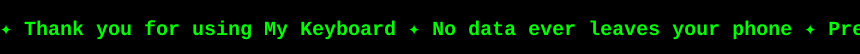

<div align="center">

[🇮🇹 Italiano](README.md) · 🇬🇧 **English**



# ⌨️ La mia tastiera — *My Keyboard*

**A personal, private, offline Android keyboard — with a '90s heart.**

[](https://github.com/bitfarmy/mykeyboard/releases/tag/v2.2.1)
[](#-installation)
[](#-project-layout)
[](#-privacy)
[](#-languages)

</div>

```text
 ┌──────────────────────────────────────┐
 │ 🗔 Start                              │
 ├──────────────────────────────────────┤
 │  📄  What is it ....................... │
 │  🔒  Privacy .......................... │
 │  🌐  Languages ........................ │
 │  🧠  Autocorrect ...................... │
 │  💾  Installation ..................... │
 │  🛠️  Building from source ............. │
 │  📁  Project layout ................... │
 │  🔑  Signing key ...................... │
 │  ❓  FAQ .............................. │
 ├──────────────────────────────────────┤
 │  ⏻  Shut Down...                      │
 └──────────────────────────────────────┘
```

---

## 📄 What is it

An Android keyboard written from scratch in Kotlin, with **no third-party libraries** and **no permission to use the Internet**. It types in six languages, completes words, fixes typos and learns the words you use — and all of it stays on your phone.

> The app's interface is in Italian. Button names below are given in Italian with an English translation, e.g. <kbd>Scarica</kbd> *(Download)*.

| | Feature | How to use it |
|:-:|---|---|
| ✏️ | **Suggestions** | Three proposals above the keys; tap one to insert it |
| 🧠 | **Careful autocorrect** | Corrects on its own only when it is 90% sure; <kbd>⌫</kbd> right after undoes it |
| 🌐 | **Six languages** | Italian built in; English, Spanish, French, German and Portuguese to download |
| ⚡ | **Shortcuts** | An abbreviation (e.g. `addr`) brings up a saved phrase (e.g. your address) |
| 🙂 | **Emoji** | Panel with categories and recents |
| 🎨 | **Eight themes** | Night, Day, Ocean, Mint, Sunset, Ink, Cyberpunk, Neon |
| ⇧ | **Capitals** | Automatic at the start of a sentence; double-tap <kbd>⇧</kbd> for caps lock |
| 🔢 | **Variants** | Long-press a key: numbers on the top row, accented letters |
| ⌨️ | **Other keyboards** | Long-press <kbd>space</kbd> or <kbd>🌐</kbd> to switch keyboard |

---

## 🔒 Privacy

<div align="center">

</div>

A keyboard sees **everything** you type: messages, searches, addresses. That is why *La mia tastiera* is built so that it cannot betray you, not even by accident:

- 🚫 **No Internet permission.** Not a promise: Android itself prevents the keyboard from connecting. The manifest requests no permissions at all.
- 🔐 **Passwords and incognito.** In password fields, and whenever an app asks for incognito mode, nothing is learned — nor from name, address or search-filter fields.
- 💽 **No cloud backups.** Learned words and shortcuts are excluded from Google backups and from transfers to a new phone.
- 🧩 **No third-party libraries.** Only Android and Kotlin: no analytics, ads or crash reporting hidden in a dependency.
- ✅ **Verified dictionaries.** An imported dictionary is accepted only if its SHA-256 fingerprint matches the one built into the app.
- ✍️ **Signed updates.** The APK is signed with a personal key that is not in the source code: nobody else can publish an "update" that Android would accept.

---

## 🌐 Languages

<div align="center">

</div>

| Language | Layout | Words | Where |
|---|---|--:|---|
| 🇮🇹 Italiano | QWERTY with <kbd>è</kbd> | 70,000 | built in |
| 🇬🇧 English | QWERTY | 60,000 | download |
| 🇪🇸 Español | QWERTY with <kbd>ñ</kbd> | 70,000 | download |
| 🇫🇷 Français | AZERTY | 70,000 | download |
| 🇩🇪 Deutsch | QWERTZ with <kbd>ü</kbd> <kbd>ö</kbd> <kbd>ä</kbd> <kbd>ß</kbd> | 70,000 | download |
| 🇧🇷 Português | QWERTY with <kbd>ç</kbd> | 70,000 | download |

### Adding a language

<div align="center">

</div>

1. Open **La mia tastiera** → section **Lingue** *(Languages)* → <kbd>Scarica</kbd> *(Download)* next to the language.<br>
   Your browser opens and downloads the file from [bitfarmy/mykeyboard-dizionari](https://github.com/bitfarmy/mykeyboard-dizionari/releases).
2. Go back to the app, tap <kbd>Importa</kbd> *(Import)* and pick the file you just downloaded (*Download* folder).
3. The language is enabled automatically. A <kbd>🌐</kbd> key appears on the keyboard: tap it to switch languages.

> 💡 **Why the browser?** Because the keyboard has no Internet access, and never will. The browser downloads, the keyboard checks the file's fingerprint and installs it.

<details>
<summary><b>Details &gt;&gt;</b> — where the words come from</summary>

<br>

Every dictionary is built by `dizionari/genera_tutti.sh`, from sources pinned to an exact commit:

- **Frequencies** — OpenSubtitles 2018 subtitles, via the [FrequencyWords](https://github.com/hermitdave/FrequencyWords) project (CC BY-SA 4.0).
- **Spelling** — every word is checked against LibreOffice's Hunspell dictionary for its language. Typical subtitle misspellings are dropped (Italian *perche*, *piu*, *citta*…), and words that need a capital keep it (*Roma*, *Haus*, *I*).
- **By hand** — the lists in `dizionari/extra/` add apostrophe forms (*c'è*, *I'm*, *c'est*) and everyday words (*whatsapp*, *email*…); a `-word` line removes a wrong form.

</details>

---

## 🧠 Autocorrect

<div align="center">

</div>

When you type a word it doesn't know, the keyboard weighs two hypotheses against each other (real numbers from the English dictionary):

```text
C:\KEYBOARD> correct "freind"

  Hypothesis A  you mistyped a dictionary word
                friend ...... very common, two letters swapped      ██████████  99.4%
                find ........ common, letters missing                ▏           0.5%
                friends ..... common, swap plus a missing letter     ▏           0.0%
  Hypothesis B  it is a real word I don't know
                does "freind" look like English? hardly              ▏           0.1%

  → friend   (99.4% sure: corrected automatically)
```

- ⌨️ **Not all mistakes cost the same**: a neighbouring key, two swapped letters or a missed double letter are likely; a random letter much less so.
- 🔤 **A letter model** recognises the typical letter sequences of each language: Italian *rwcentemente* doesn't look like a word, *constatando* does — so the latter is left alone.
- 🎯 **Below 90% it only suggests**: the highlighted correction in the bar is always exactly what <kbd>space</kbd> will apply.
- 🏷️ **Names are respected**: a capitalised word in the middle of a sentence (*Marta*, *Fiat*) is never corrected automatically.
- ↩️ **Changed your mind?** <kbd>⌫</kbd> right after a correction undoes it, and it won't be suggested again in that field. Undo it a second time, even later, and the keyboard learns your word.

<details>
<summary><b>Details &gt;&gt;</b> — how the numbers were measured</summary>

<br>

The test bench (`dizionari/banco_di_prova/`) generates 3,000 realistic typos of common Italian words and collects 3,000 valid but rare words that are missing from the dictionary. The autocorrect parameters were tuned on one data set and verified on a different one, never seen before: the numbers above come from the latter.

| | v0.1 | v2.2.1 |
|---|--:|--:|
| Typos fixed automatically | 86.6% | 77.5% *(+18.1% suggested in the bar)* |
| **Typos "fixed" into the wrong word** | **12.5%** | **1.4%** |
| Valid but rare words ruined | 31.5% | 21.7% |
| Time per word (desktop) | — | ~2.5 ms |

This trade-off is deliberate: correcting a little less on its own, but getting it wrong almost nine times less often. A word ruined by the keyboard is worse than a typo left alone.

</details>

---

## 💾 Installation

1. Download **`la-mia-tastiera-2.2.1.apk`** from the latest [release](https://github.com/bitfarmy/mykeyboard/releases/latest).
2. Open it on your phone and allow installing from unknown sources.
3. Open **La mia tastiera** and tap the two buttons: <kbd>1. Abilitala</kbd> *(Enable it)* and <kbd>2. Sceglila come tastiera attiva</kbd> *(Make it the active keyboard)*.

> ⚠️ **Running version 0.1?** 2.2.1 is signed with a new key, so Android won't install it over the old one. Write down your shortcuts, uninstall 0.1 and install this one. From now on updates will install normally.

---

## 🛠️ Building from source

**With Android Studio:** *File → Open* the `TastieraPersonale` folder, then <kbd>Run ▶</kbd>.

**From the command line** (JDK 17–21, Gradle 8.11):

```bat
C:\> cd TastieraPersonale
C:\KEYBOARD> gradle testDebugUnitTest      &REM autocorrect tests
C:\KEYBOARD> gradle assembleRelease        &REM APK signed with your key
```

**On GitHub:** every push starts a build in the **Actions** tab: tests, an APK signed with the key from the repository secrets, and a downloadable `la-mia-tastiera` artifact.

---

## 📁 Project layout

```text
📁 mykeyboard
├── 📁 TastieraPersonale ............. the Android app
│   ├── 📁 app/src/main/java/…/tastiera
│   │   ├── 📄 TastieraService.kt ..... the "brain": keys, corrections, languages
│   │   ├── 📄 Lessico.kt ............. suggestions and autocorrect (no Android, tested)
│   │   ├── 📄 Dizionario.kt .......... dictionary loading and learned words
│   │   ├── 📄 Layout.kt .............. key layout for each language
│   │   ├── 📄 ImportaDizionario.kt ... import with SHA-256 check
│   │   ├── 📄 CatalogoDizionari.kt ... dictionary fingerprints (generated)
│   │   ├── 📄 ImpostazioniActivity.kt  the settings screen
│   │   ├── 📄 TastieraView.kt ........ key drawing and touch handling
│   │   └── 📄 Temi.kt ................ colours and preferences
│   ├── 📁 app/src/test ............... autocorrect tests and test bench
│   └── 📄 README.md .................. detailed technical guide (Italian)
├── 📁 dizionari
│   ├── 📄 genera_tutti.sh ............ rebuilds dictionaries and catalogue
│   ├── 📁 extra ...................... words added and removed by hand
│   └── 📁 banco_di_prova ............. autocorrect measurements
└── 📁 docs/img ....................... the illustrations in this file
```

The code and comments are in Italian. For technical details (dictionary format, autocorrect parameters, adding a language) see [`TastieraPersonale/README.md`](TastieraPersonale/README.md).

---

## 🔑 Signing key

The APK is signed with a personal key that is **not in the repository**:

- on the computer: `~/.android-chiavi/tastiera.jks` + `keystore.properties` (Android Studio and Gradle find it automatically);
- on GitHub: in the secrets `KEYSTORE_BASE64`, `KEYSTORE_PASSWORD`, `KEY_ALIAS`, `KEY_PASSWORD`.

> 💾 **Back it up.** If the key is lost, no further updates can be published: the only option is to uninstall and reinstall.

---

## ❓ FAQ

<details>
<summary><b>The keyboard "corrected" a word that was right. What now?</b></summary>
<br>
Press <kbd>⌫</kbd> straight away: the correction is undone and won't be applied again while you stay in that field. The second time you undo the same correction, the keyboard learns your word and stops correcting it. Typos that aren't corrected are never learned behind your back.
</details>

<details>
<summary><b>Can I delete the learned words?</b></summary>
<br>
Yes: settings → <b>Cancella le parole imparate</b> <i>(Delete learned words)</i>. The dictionaries stay.
</details>

<details>
<summary><b>"File not recognised" when importing a dictionary</b></summary>
<br>
The file was modified, got corrupted during download, or belongs to another version. Download it again with the language's <kbd>Scarica</kbd> <i>(Download)</i> button.
</details>

<details>
<summary><b>Why isn't my language available?</b></summary>
<br>
Adding one is simple: an entry in <code>Layout.kt</code> (key layout and accents) and a line in <code>dizionari/genera_tutti.sh</code>. See the technical guide.
</details>

---

## 📜 Licences and credits

- **Dictionaries**: CC BY-SA 4.0. Frequencies come from Hermit Dave's [FrequencyWords](https://github.com/hermitdave/FrequencyWords) (OpenSubtitles 2018); spelling is checked against LibreOffice's Hunspell dictionaries (via [wooorm/dictionaries](https://github.com/wooorm/dictionaries)).
- **Code**: a personal project by [@bitfarmy](https://github.com/bitfarmy).
- **Look & feel**: a tribute to Windows 95. The illustrations are hand-drawn SVGs generated by `docs/img/genera_svg.py`, with no external images or fonts.

<div align="center">
<br>

<br>
<sub>It's now safe to turn off your computer.</sub>
</div>
