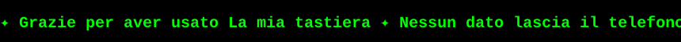

<div align="center">

🇮🇹 **Italiano** · [🇬🇧 English](README.en.md)



# ⌨️ La mia tastiera

**Una tastiera Android personale, privata e offline — con un cuore anni '90.**

[](https://github.com/bitfarmy/mykeyboard/releases/tag/v2.2.0)
[](#-installazione)
[](#-struttura-del-progetto)
[](#-privacy)
[](#-lingue)

</div>

```text
 ┌──────────────────────────────────────┐
 │ 🗔 Avvio                              │
 ├──────────────────────────────────────┤
 │  📄  Cos'è ............................ │
 │  🔒  Privacy .......................... │
 │  🌐  Lingue ........................... │
 │  🧠  Il correttore .................... │
 │  💾  Installazione .................... │
 │  🛠️  Compilare dal codice .............. │
 │  📁  Struttura del progetto ........... │
 │  🔑  Chiave di firma .................. │
 │  ❓  Domande frequenti ................ │
 ├──────────────────────────────────────┤
 │  ⏻  Chiudi sessione...                │
 └──────────────────────────────────────┘
```

---

## 📄 Cos'è

Una tastiera per Android scritta da zero in Kotlin, **senza nessuna libreria esterna** e **senza il permesso di usare Internet**. Scrive in sei lingue, completa le parole, corregge gli errori di battitura e impara le parole che usi, ma tutto resta sul telefono.

| | Funzione | Come si usa |
|:-:|---|---|
| ✏️ | **Suggerimenti** | Tre proposte sopra i tasti; tocca per inserirle |
| 🧠 | **Autocorrezione prudente** | Corregge da sola solo se è sicura al 90%; <kbd>⌫</kbd> subito dopo la annulla |
| 🌐 | **Sei lingue** | Italiano incluso; inglese, spagnolo, francese, tedesco e portoghese da scaricare |
| ⚡ | **Scorciatoie** | Una sigla (es. `ind`) fa comparire una frase salvata (es. il tuo indirizzo) |
| 🙂 | **Emoji** | Pannello con categorie e recenti |
| 🎨 | **Otto temi** | Notte, Giorno, Oceano, Menta, Tramonto, Inchiostro, Cyberpunk, Neon |
| ⇧ | **Maiuscole** | Automatiche a inizio frase; doppio tocco su <kbd>⇧</kbd> per il blocco |
| 🔢 | **Varianti** | Tieni premuto un tasto: numeri sulla prima riga, lettere accentate |
| ⌨️ | **Altre tastiere** | Tieni premuto <kbd>spazio</kbd> o <kbd>🌐</kbd> per cambiare tastiera |

---

## 🔒 Privacy

<div align="center">

</div>

Una tastiera vede **tutto** quello che scrivi: messaggi, ricerche, indirizzi. Per questo *La mia tastiera* è costruita perché non possa tradirti, nemmeno per sbaglio:

- 🚫 **Nessun permesso Internet.** Non è una promessa: è Android stesso che le impedisce di collegarsi. Il manifest non chiede nessun permesso.
- 🔐 **Password e incognito.** Nei campi password e quando un'app chiede la modalità incognito non impara nulla, e nemmeno da nomi, indirizzi e filtri di ricerca.
- 💽 **Niente backup nel cloud.** Le parole imparate e le scorciatoie sono escluse dal backup di Google e dal trasferimento verso un nuovo telefono.
- 🧩 **Nessuna libreria esterna.** Solo Android e Kotlin: niente statistiche, pubblicità o raccolta errori nascosta in una dipendenza.
- ✅ **Dizionari verificati.** Un dizionario importato viene accettato solo se la sua impronta SHA-256 coincide con quella scritta nell'app.
- ✍️ **Aggiornamenti firmati.** L'APK è firmato con una chiave personale che non sta nel codice: nessun altro può pubblicare un "aggiornamento" che Android accetti.

---

## 🌐 Lingue

<div align="center">

</div>

| Lingua | Tastiera | Parole | Dove |
|---|---|--:|---|
| 🇮🇹 Italiano | QWERTY con <kbd>è</kbd> | 70.000 | incluso nell'app |
| 🇬🇧 English | QWERTY | 60.000 | da scaricare |
| 🇪🇸 Español | QWERTY con <kbd>ñ</kbd> | 70.000 | da scaricare |
| 🇫🇷 Français | AZERTY | 70.000 | da scaricare |
| 🇩🇪 Deutsch | QWERTZ con <kbd>ü</kbd> <kbd>ö</kbd> <kbd>ä</kbd> <kbd>ß</kbd> | 70.000 | da scaricare |
| 🇧🇷 Português | QWERTY con <kbd>ç</kbd> | 70.000 | da scaricare |

### Aggiungere una lingua

<div align="center">

</div>

1. Apri **La mia tastiera** → sezione **Lingue** → <kbd>Scarica</kbd> accanto alla lingua.<br>
   Si apre il browser e scarica il file da [bitfarmy/mykeyboard-dizionari](https://github.com/bitfarmy/mykeyboard-dizionari/releases).
2. Torna nell'app e tocca <kbd>Importa</kbd>, poi scegli il file appena scaricato (cartella *Download*).
3. La lingua si attiva da sola. Sulla tastiera compare <kbd>🌐</kbd>: toccalo per passare da una lingua all'altra.

> 💡 **Perché il browser?** Perché la tastiera non ha accesso a Internet, e non lo avrà. Il browser scarica, la tastiera controlla l'impronta del file e lo installa.

<details>
<summary><b>Dettagli &gt;&gt;</b> — da dove vengono le parole</summary>

<br>

Ogni dizionario nasce da `dizionari/genera_tutti.sh`, con fonti fissate a un commit preciso:

- **Frequenze** — i sottotitoli di OpenSubtitles 2018, dal progetto [FrequencyWords](https://github.com/hermitdave/FrequencyWords) (CC BY-SA 4.0).
- **Ortografia** — ogni parola è controllata con il dizionario Hunspell di LibreOffice della sua lingua. Così restano fuori gli errori tipici dei sottotitoli (*perche*, *piu*, *citta*…), e le parole che vogliono la maiuscola la mantengono (*Roma*, *Haus*, *I*).
- **A mano** — le liste in `dizionari/extra/` aggiungono le forme con apostrofo (*c'è*, *I'm*, *c'est*) e le parole di tutti i giorni (*whatsapp*, *bonifico*…); con `-parola` tolgono le forme sbagliate.

</details>

---

## 🧠 Il correttore

<div align="center">

</div>

Quando scrivi una parola che non conosce, la tastiera mette a confronto due ipotesi:

```text
C:\TASTIERA> correggi "tuto"

  Ipotesi A  hai sbagliato a battere una parola del dizionario
             tutto ...... comunissima, ti è sfuggita una doppia   ██████████  99,2%
             tutti ...... comune, una lettera diversa             ▏            0,2%
             tuo ........ comune, una lettera in più              ▏            0,1%
  Ipotesi B  è una parola vera che non conosco
             "tuto" sembra italiano? poco                         ▏            0,4%

  → tutto   (sicura al 99,2%: la correggo da sola)
```

- ⌨️ **Gli errori costano diversamente**: un tasto vicino, due lettere invertite o una doppia dimenticata (*tuto → tutto*) sono probabili; una lettera a caso molto meno.
- 🔤 **Un modello delle lettere** riconosce le sequenze tipiche della lingua: *rwcentemente* non sembra italiano, *constatando* sì — e infatti la seconda non viene toccata.
- 🎯 **Sotto il 90% propone e basta**: la correzione evidenziata nella barra è sempre quella che <kbd>spazio</kbd> applicherà.
- 🏷️ **I nomi sono rispettati**: una parola con la maiuscola a metà frase (*Marta*, *Fiat*) non viene corretta da sola.
- ↩️ **Ti sei pentito?** <kbd>⌫</kbd> subito dopo una correzione la annulla, e in quel campo non la ripropone. Se la annulli una seconda volta, anche in un altro momento, la tastiera impara la tua parola.

<details>
<summary><b>Dettagli &gt;&gt;</b> — come sono stati misurati i numeri</summary>

<br>

Il banco di prova (`dizionari/banco_di_prova/`) genera 3.000 errori di battitura realistici su parole comuni e raccoglie 3.000 parole giuste ma rare, assenti dal dizionario. I parametri del correttore sono stati tarati con un insieme di dati e verificati con un altro, mai visto prima: i numeri qui sopra vengono da quest'ultimo.

| | v0.1 | v2.2.0 |
|---|--:|--:|
| Refusi corretti da soli | 86,6% | 77,5% *(+18,1% proposti nella barra)* |
| **Refusi corretti nel modo sbagliato** | **12,5%** | **1,4%** |
| Parole giuste ma rare rovinate | 31,5% | 21,7% |
| Tempo per parola (computer) | — | ~2,5 ms |

La scelta è voluta: correggere un po' meno da sola, ma sbagliare quasi nove volte di meno. Una parola rovinata dalla tastiera è peggio di un refuso lasciato lì.

</details>

---

## 💾 Installazione

1. Scarica **`la-mia-tastiera-2.2.0.apk`** dall'ultima [release](https://github.com/bitfarmy/mykeyboard/releases/latest).
2. Aprilo sul telefono e permetti l'installazione da origini sconosciute.
3. Apri **La mia tastiera** e tocca i due pulsanti: <kbd>1. Abilitala</kbd> e <kbd>2. Sceglila come tastiera attiva</kbd>.

> ⚠️ **Hai la versione 0.1?** La 2.2.0 è firmata con una chiave nuova, quindi Android non la installa sopra la vecchia. Annota le tue scorciatoie, disinstalla la 0.1 e installa questa. Da qui in poi gli aggiornamenti si installeranno normalmente.

---

## 🛠️ Compilare dal codice

**Con Android Studio:** *File → Open* sulla cartella `TastieraPersonale`, poi <kbd>Run ▶</kbd>.

**Da riga di comando** (JDK 17–21, Gradle 8.11):

```bat
C:\> cd TastieraPersonale
C:\TASTIERA> gradle testDebugUnitTest      &REM i test del correttore
C:\TASTIERA> gradle assembleRelease        &REM APK firmato con la tua chiave
```

**Su GitHub:** ogni push avvia la compilazione nella scheda **Actions**: test, APK firmato con la chiave dei secret del repository, artefatto `la-mia-tastiera` da scaricare.

---

## 📁 Struttura del progetto

```text
📁 mykeyboard
├── 📁 TastieraPersonale ............. l'app Android
│   ├── 📁 app/src/main/java/…/tastiera
│   │   ├── 📄 TastieraService.kt ..... il "cervello": tasti, correzioni, lingue
│   │   ├── 📄 Lessico.kt ............. suggerimenti e correttore (senza Android, con test)
│   │   ├── 📄 Dizionario.kt .......... caricamento dei dizionari e parole imparate
│   │   ├── 📄 Layout.kt .............. disposizione dei tasti per ogni lingua
│   │   ├── 📄 ImportaDizionario.kt ... importazione con verifica SHA-256
│   │   ├── 📄 CatalogoDizionari.kt ... impronte dei dizionari (generato)
│   │   ├── 📄 ImpostazioniActivity.kt  la schermata delle impostazioni
│   │   ├── 📄 TastieraView.kt ........ disegno dei tasti e tocchi
│   │   └── 📄 Temi.kt ................ colori e preferenze
│   ├── 📁 app/src/test ............... test del correttore e banco di prova
│   └── 📄 README.md .................. guida tecnica dettagliata
├── 📁 dizionari
│   ├── 📄 genera_tutti.sh ............ rigenera dizionari e catalogo
│   ├── 📁 extra ...................... parole aggiunte e tolte a mano
│   └── 📁 banco_di_prova ............. misura del correttore
└── 📁 docs/img ....................... le illustrazioni di questo file
```

Per i dettagli tecnici (formato dei dizionari, parametri del correttore, come aggiungere una lingua) vedi [`TastieraPersonale/README.md`](TastieraPersonale/README.md).

---

## 🔑 Chiave di firma

L'APK è firmato con una chiave personale che **non sta nel repository**:

- sul computer: `~/.android-chiavi/tastiera.jks` + `keystore.properties` (Android Studio e Gradle la trovano da soli);
- su GitHub: nei secret `KEYSTORE_BASE64`, `KEYSTORE_PASSWORD`, `KEY_ALIAS`, `KEY_PASSWORD`.

> 💾 **Fanne un backup.** Se la chiave va persa, non si possono più pubblicare aggiornamenti: si può solo disinstallare e reinstallare.

---

## ❓ Domande frequenti

<details>
<summary><b>La tastiera ha corretto una parola giusta. Come faccio?</b></summary>
<br>
Premi <kbd>⌫</kbd> subito dopo: la correzione viene annullata e, finché resti in quel campo, non viene riproposta. Alla seconda volta che annulli la stessa correzione la tastiera impara la tua parola e non la corregge più. I refusi che non vengono corretti, invece, non vengono mai imparati di nascosto.
</details>

<details>
<summary><b>Posso cancellare le parole imparate?</b></summary>
<br>
Sì: impostazioni → <b>Cancella le parole imparate</b>. I dizionari restano.
</details>

<details>
<summary><b>"File non riconosciuto" quando importo un dizionario</b></summary>
<br>
Il file è stato modificato, si è rovinato nel download oppure è di un'altra versione. Scaricalo di nuovo con il pulsante <kbd>Scarica</kbd> della lingua.
</details>

<details>
<summary><b>Perché non c'è la mia lingua?</b></summary>
<br>
Aggiungerne una è semplice: una voce in <code>Layout.kt</code> (disposizione dei tasti e accenti) e una riga in <code>dizionari/genera_tutti.sh</code>. Vedi la guida tecnica.
</details>

---

## 📜 Licenze e crediti

- **Dizionari**: CC BY-SA 4.0. Le frequenze vengono da [FrequencyWords](https://github.com/hermitdave/FrequencyWords) di Hermit Dave (OpenSubtitles 2018); l'ortografia è verificata con i dizionari Hunspell di LibreOffice (tramite [wooorm/dictionaries](https://github.com/wooorm/dictionaries)).
- **Codice**: progetto personale di [@bitfarmy](https://github.com/bitfarmy).
- **Estetica**: un omaggio a Windows 95. Le illustrazioni sono SVG disegnati a mano dallo script `docs/img/genera_svg.py`, senza immagini o font esterni.

<div align="center">
<br>

<br>
<sub>Ora è possibile spegnere il computer in tutta sicurezza.</sub>
</div>
